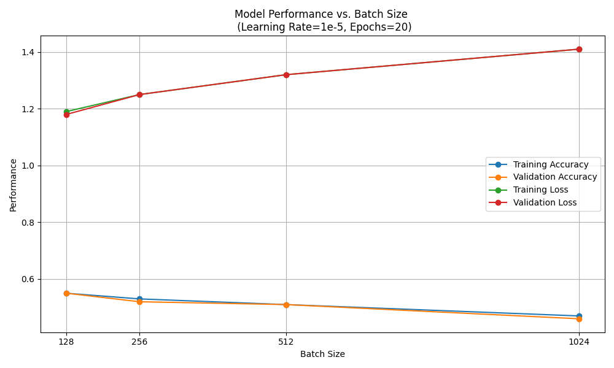
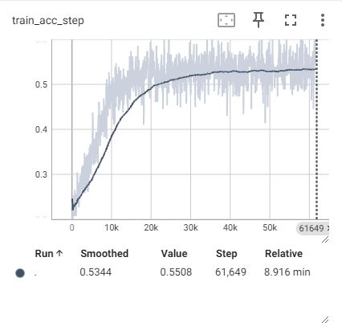
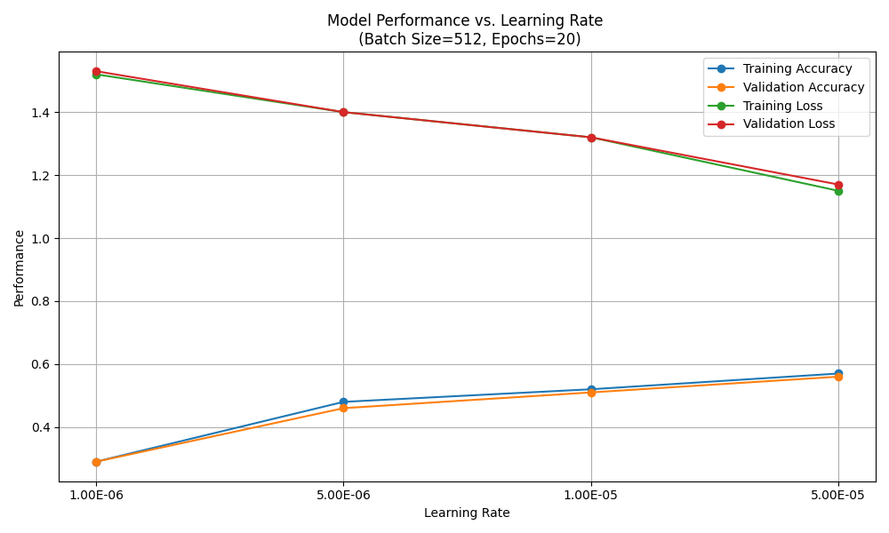

# Lab1

##### 1.	What is the impact of varying batch sizes and why?
Fix other hyperparameters but vary batch size to observe the model performance after training 20 epochs:

It is clear to see that the model performs worse with larger batch size. This is because smaller batch sizes allow the model to update more frequently based on noisier estimates of the gradient, which can help prevent overfitting and improve generalization. Also, if keeping learning rate constant, large batch size causes the model slower to converge, thus seeing a lower accuracy within limited epochs.

In addition to model performance, varying batch sizes can also affect training speed, especially for training on GPU where computations are highly parallel. If batch size fits the GPU memory, then backpropagations of data in a whole batch can be done in parallel, thus training speed is maximized.

##### 2.	What is the impact of varying maximum epoch number?
Figure below shows the model performance as training goes on epoch by epoch:


With limited epoch number, the model have not converges to its optimal weights before training finishes (i.e., underfitting). If max epoch number is too large, however, the model may be overfitted. In this case the training loss is smaller than testing loss, and the model cannot generalize well.

##### 3.	What is happening with a large learning rate and what is happening with a small learning rate and why? What is the relationship between learning rates and batch sizes?
Fix other hyperparameters but vary learning rates to observe the model performance after training 20 epochs:


It is clear that the model is more accurate if trained with larger learning rate. This is because larger learning rates make the model faster to converge. However, if learning rate is too large, the parameter updates might become unstable and the optimization process may diverge.

[The Linear Scaling Rule](https://www.cs.princeton.edu/~smalladi/blog/2024/01/22/SDEs-ScalingRules/) suggests a empirical relationship between learning rate and batch size. If increasing learning rate, larger batch size should be used to balance the speed of parameter update in each batch. How much should the batch size increase depends on the type of SGD optimizer used.


##### 4.	Implement a network that has in total around 10x more parameters than `jsc-tiny`.

Here I implemented a network with much more layers than `jsc-tiny`:
```Python
# machop/chop/models/physical/jet_substructure/__init__.py
class JSC_Zixian(nn.Module):
    def __init__(self, info):
        super(JSC_Zixian, self).__init__()
        self.seq_blocks = nn.Sequential(
            # 1st LogicNets Layer
            nn.BatchNorm1d(16),  # input_quant       # 0
            nn.ReLU(16),  # 1
            nn.Linear(16, 32),  # linear              # 2
            nn.BatchNorm1d(32),  # output_quant       # 3
            nn.ReLU(32),  # 4

            # 2nd LogicNets Layer
            nn.Linear(32, 16),  # 5
            nn.BatchNorm1d(16),  # 6
            nn.ReLU(16),  # 7

            # 3rd LogicNets Layer
            nn.Linear(16, 8),  # 8
            nn.BatchNorm1d(8),  # 9
            nn.ReLU(8),  # 10

            # 4th LogicNets Layer
            nn.Linear(8, 8),  # 11
            nn.BatchNorm1d(8),  # 12
            nn.ReLU(8),  # 13

            # 5th LogicNets Layer
            nn.Linear(8, 5),  # 14
            nn.BatchNorm1d(5),  # 15
            nn.ReLU(5),
        )

    def forward(self, x):
        return self.seq_blocks(x)
```
After defining the model `JSC-Zixian`, also update the macro `PHYSICAL_MODELS` to ensure that the model can be found and invoked by MASE Cli:

```Python
# machop/chop/models/physical/__init__.py
PHYSICAL_MODELS = {
    ...
    "jsc-zixian": {
        "model": get_jsc_zixian,
        "info": MaseModelInfo(
            "jsc-s",
            model_source="physical",
            task_type="physical",
            physical_data_point_classification=True,
            is_fx_traceable=True,
        ),
    },
}
```

##### 5.	Test your implementation and evaluate its performance.

Training the model `JSC-Zixian` with the configuration: 
```
max_epochs=20, batch_size=256, learning_rate=1e-5.
```

The model performance is shown below:
Training Acc|Val Acc|Training Loss|Val Loss
:---:|:---:|:---:|:---:
0.701|0.696|0.902|0.910


