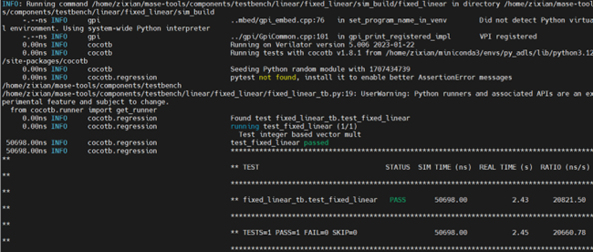
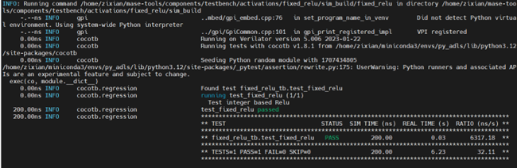
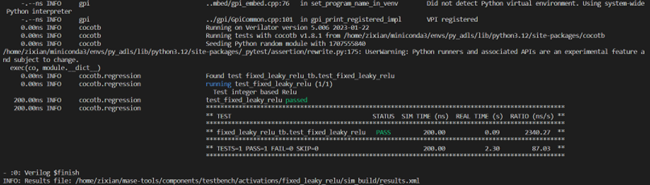

# Lab4

##### 1. Read this page for more information on the hardware metadata pass. Why we have such a metadata setup? How is this different from the software metadata? 

This pass adds all the required metadata, which is used when emitting Verilog files by the `emit_verilog` pass. The hardware metadata is analogous to arguments for “assembling” the RTL project. Here shows how these “arguments” take effect:
* `toolchain`: defines whether to use the internal Verilog IPs from `mase/machop_components` library or to execute HLS flow.
* `module`: defines the name of the used Verilog IP. e.g., if `module=’fixed_linear’`, the pass finds module `fixed_linear.sv` from the IP library and then instantiate it using the metadata `verilog_param`.
* `dependency files`: defines the Verilog IP files for Verilator to include when compiling the RTL project.

Software metadata, however, mainly records statistics of input and output data for each node, such as variance, max and min value. These statistics is used for front-end transforms such as quantization and is mostly irrelevant to hardware implementation.

##### 2. Read through `top/hardware/rtl/top.sv` and make sure you understand how our MLP model maps to this hardware design. Explain what each part is doing in the `.sv` file. 

Each layer in the MLP model is mapped to an IP module in the `top.sv` file.
The quantized `nn.Linear` module in MLP is mapped to `fixed_linear` module defined in `mase_compoenents/linear/fixed_linear.sv`. 
The quantized `nn.functional.relu` function is mapped to `fixed_relu` module defined in `mase_components/activations/fixed_relu.sv`.

Besides, the weight data for the linear layer is stored in BRAM in the module 	`fc1_weight_source`. The module is driven by `clk` signal and sends data to the bus `fc1_weight`, which is fed to the `fixed_linear` module for computation. The same process applies to bias data as well.

There are also `valid` and `ready` signal wires defined in `top.sv`. They serve as interface between the IP blocks.

##### 3. Launch the simulation, log and show the simulation results.

`fixed_linear.sv`: 

`fixed_relu.sv`:

Apparently, the module `fixed_linear` consumes much more clock cycles than `fixed_relu`. This is because linear layer contains matrix computation while no complicated operations exist in ReLU layer.

##### 4. Choose another layer type from the Pytorch list and write a System Verilog file to implement that layer in hardware. Then, change the generated top.sv file to inject that layer within the design. For example, you may replace the ReLU activations with Leaky ReLU. Re-build the simulation and observe the effect on latency and accuracy.

The layer implemented here is the [Leaky ReLU](https://pytorch.org/docs/stable/generated/torch.nn.RReLU.html#torch.nn.RReLU) layer:
    $$ LeakyReLU(x)=max(0,x)+negative_slope∗min(0,x) $$
As floating-point multiplication is hard to implement in System Verilog, the `negative_slope` parameter of the Leaky ReLU module is constrained to `0.5**BIAS`, where `BIAS` is the parameter for the `fixed_leaky_relu` IP block. If the input `data_in` is negative, it is shifted right (sign-extended) by `BIAS` bits, hence being multiplied by `0.5**BIAS`. Figure below shows the simulation results. The simulated latency is the same as that of `fixed_relu` module, as both of them takes one cycle to operate.

Simulation result:

